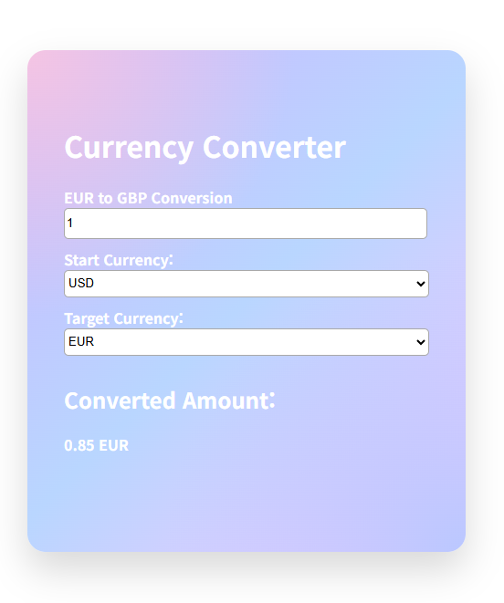

# 💱 Currency Converter

A simple **React currency converter** built as a small project for **freeCodeCamp**.
This project focuses on **state management**, **memoization**, and **clear logic design using pseudocode**.

---

## Preview



---

## 📌 Overview

This application allows users to:

* Enter an amount
* Select a **start currency**
* Select a **target currency**
* Instantly see the converted result

---

## 🧠 Key Learning Goals

* Understanding **controlled inputs** in React
* Using **`useMemo`** to memoize derived calculations
* Preventing recalculation when unrelated state changes
* Writing **pseudocode first** to design function logic clearly
* Converting pseudocode into real JavaScript step by step

---

## ⚙️ Tech Stack

* **React 18** (via CDN)
* **JavaScript (ES6+)**
* **HTML / CSS**
* **Babel (standalone)**

No build tools or frameworks were used — the app runs directly in the browser.

---

## 🔁 Conversion Logic (Concept)

Instead of recalculating the conversion every time the target currency changes:

1. Convert the input amount into a **base currency (USD)**
2. Memoize conversions for **all currencies at once**
3. Read the selected target currency from the memoized object

This ensures:

* Changing the **target currency** does **not** trigger recalculation
* Only changes to **amount** or **start currency** cause recomputation

---

## ✍️ Pseudocode-Driven Development

Before writing the conversion logic, the steps were written in pseudocode:

```
IF start currency is empty
  RETURN empty object

CONVERT quantity to number
IF quantity is invalid
  RETURN empty object

GET start currency rate
CONVERT amount to base currency

FOR each currency
  CALCULATE converted amount
  STORE result

RETURN all converted values
```

This approach helped:

* Reduce logic errors
* Improve readability
* Make the final code easier to reason about

---

## 🧩 Features

* Controlled `<input>` and `<select>` elements
* Memoized currency conversion using `useMemo`
* Prevents unnecessary recalculation
* Simple, clean UI
* Glass-style gradient card design

---

## 🚀 How to Run

1. Download or clone the project
2. Open `index.html` in a browser
3. No installation or build step required

---

## 📚 What I Learned

* How `useMemo` works with dependency arrays
* Why derived state should not be stored separately
* How to separate **calculation logic** from **UI state**
* How pseudocode can simplify complex logic before coding

---

## 📝 Notes

* Exchange rates are static and for demonstration purposes
* This project focuses on React fundamentals rather than real-time APIs

---

### Author

Built as part of a **freeCodeCamp learning project**
by Ria Choi ✨